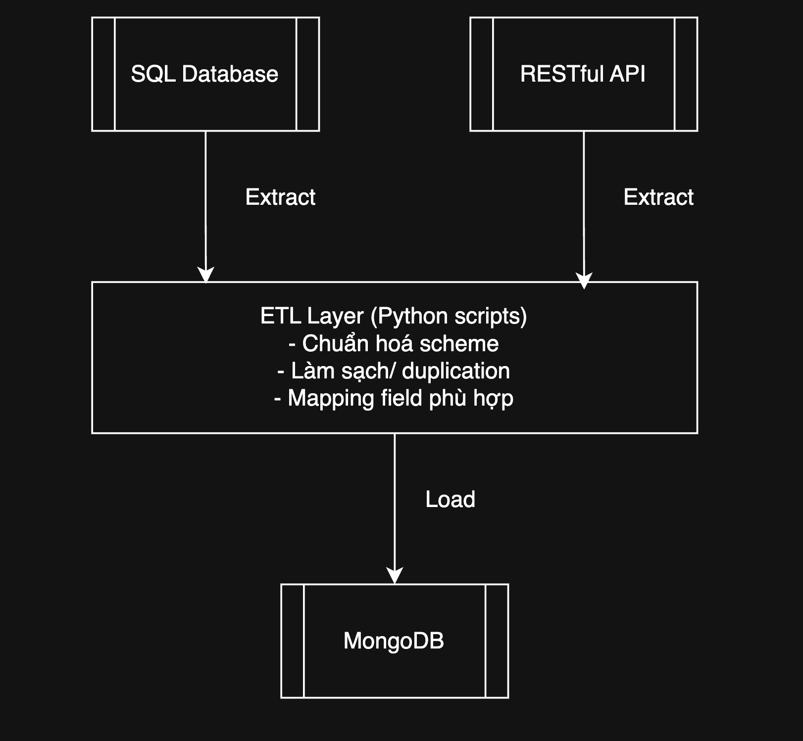

# Customer Data Platform

## Mô tả
Dự án Customer Data Platform tích hợp dữ liệu khách hàng từ một SQL database và một RESTful API, 
chuẩn hóa và lưu trữ vào MongoDB (NoSQL).

## Phân tích bài toán
- Tích hợp dữ liệu khách hàng từ 2 nguồn: SQL (SQLite) và RESTful API
- Hợp nhất (normalize + deduplicate) thành 1 định dạng schema chuẩn
- Lưu trữ dữ liệu kết quả vào một NoSQL DB (MongoDB)
- Đảm bảo bảo mật, và dễ mở rộng

## Công nghệ sử dụng
| Thành phần     | Công nghệ                          |
|----------------|----------------------------------- |
| Ngôn ngữ chính | Python 3.12                        |
| SQL Extractor  | SQLite3 (`sqlite3` module)         |
| API Extractor  | REST client (`requests`)           |
| Chuẩn hóa      | Pandas                             |
| NoSQL Loader   | MongoDB (`pymongo`)                |
| API mock       | FastAPI (`mock_api.py`)            |
| Cấu hình       | `.env`, `config/settings.py`       |

## Kiến trúc tổng thể


## Cách chạy

1. Di chuyển vào thư mục project
    ```bash
    cd pnj_test

2. Tạo virtual env
    ```bash
    python -m venv venv
    source venv/bin/activate    

3. Cài thư viện
    ```bash
    pip install -r requirements.txt

4. Chạy mock REST API:
    ```bash
    uvicorn mock_api:app --reload